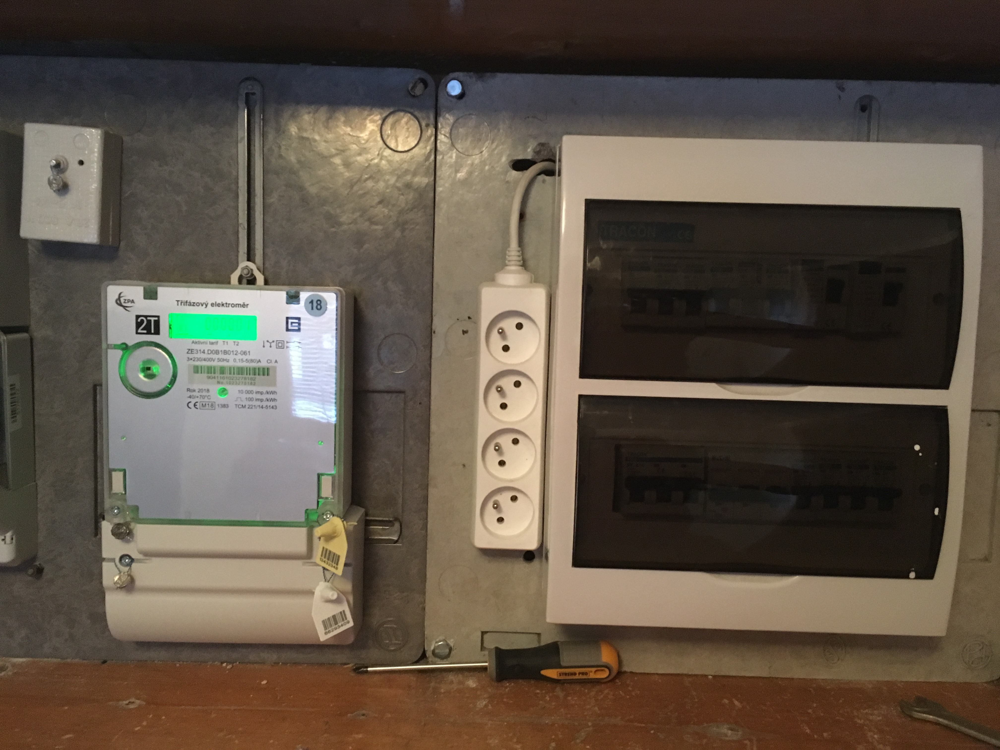
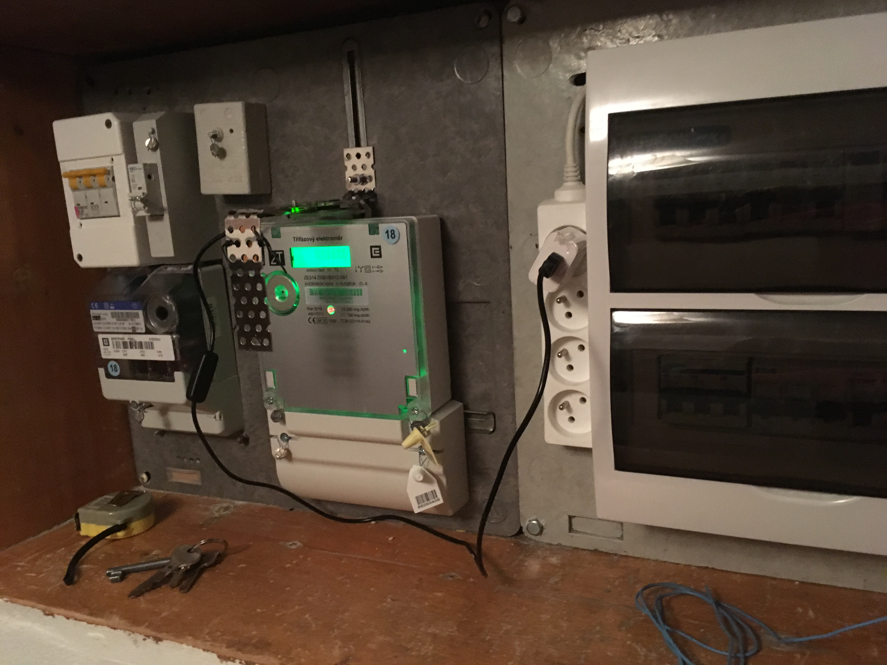
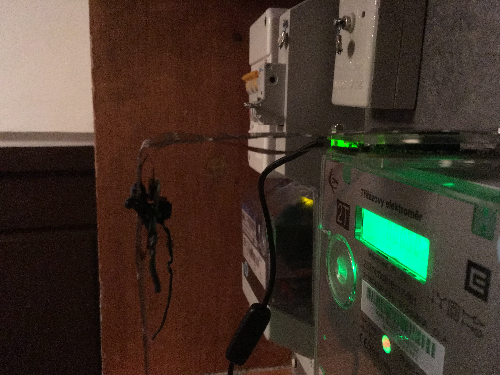
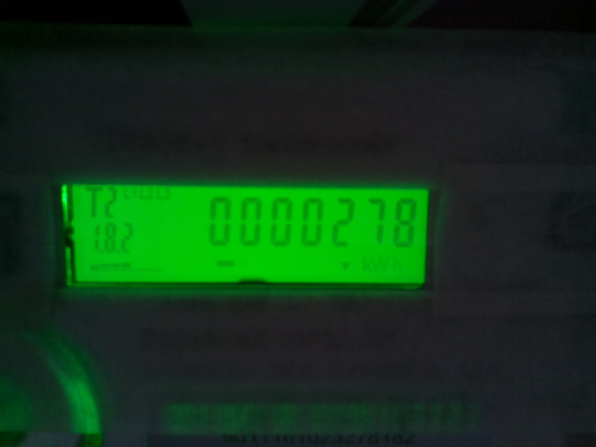

# Description

I installed at my home the heat pump. This kind of device consumes some electrical energy to transfer heat to my home. I am really curious how much electrical energy needs this device daily. So I decided to monitor main electricity meter of my home. I bought raspberry pi zero W, picamera version 1.3. I am capturing frames of electricity meter digit display. Every image is digitally preprocessed. It is recognised position of display in the frame and seven digits as you can see on images bellow.
The really nice article about digits recognition with opencv and python is [here](https://www.pyimagesearch.com/2017/02/13/recognizing-digits-with-opencv-and-python/). The article inspired me a lot and I only modified the described code to fit to my project.

## Physical Setup
<p align="left"> </p>
<p align="left"> </p>
<p align="left"> </p>
<p align="left"> </p>

# Installation
For installation opencv I follow [this](https://yoursunny.com/t/2018/install-OpenCV3-PiZero/) instructions.

```javascript
#Enable my Pi Zero repository:
echo 'deb [trusted=yes] http://dl.bintray.com/yoursunny/PiZero stretch-backports main' |\
  sudo tee  /etc/apt/sources.list.d/bintray-yoursunny-PiZero.list

#Update package lists:
sudo apt update

#Install OpenCV package:
sudo apt install python3-opencv

#Depending on the speed of your Internet connection, this may take between 15 and 30 minutes.
#Verify the installation:
python3 -c 'import cv2; print(cv2.__version__)'

#It will take around 30 seconds, and then you should see:
#3.2.0
```
After that I installed 
```
sudo apt-get install libatlas-base-dev
sudo pip3 install scipy
sudo pip3 install imutils
```

# Run

```
python3 capture_digits.py
```

Results should be look similar this

```
# segments recognition
[1, 1, 1, 1, 0, 1, 1]
[1, 1, 1, 1, 1, 1, 1]
[1, 0, 1, 1, 1, 0, 1]
[1, 1, 1, 0, 1, 1, 1]
[1, 1, 1, 0, 1, 1, 1]
[1, 1, 1, 0, 1, 1, 1]
[1, 1, 1, 0, 1, 1, 0]

# digits recognition
[9, 8, 2, 0, 0, 0, 0]
```


